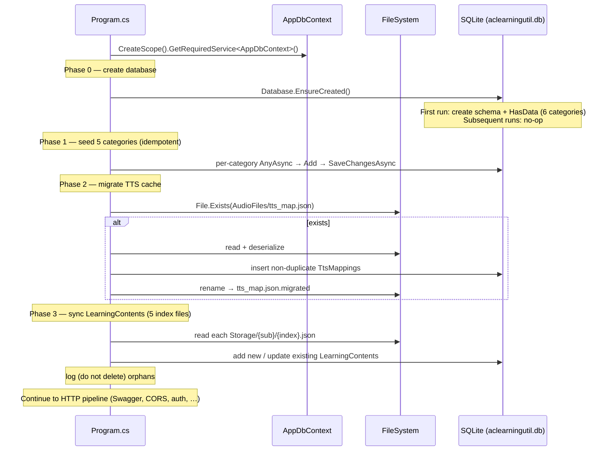
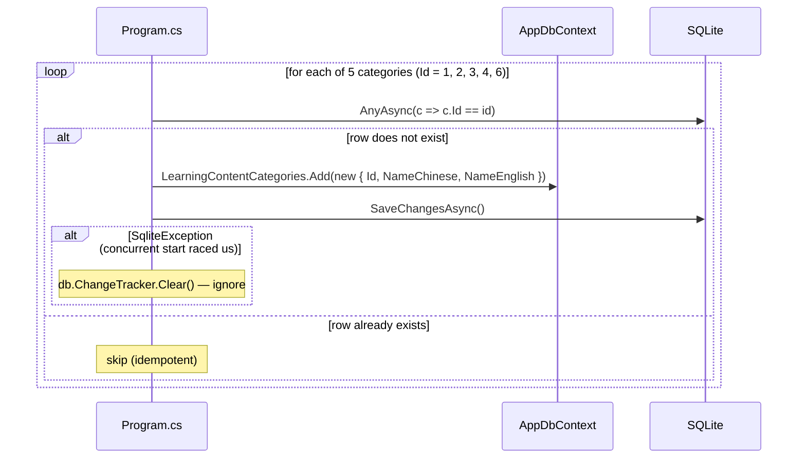
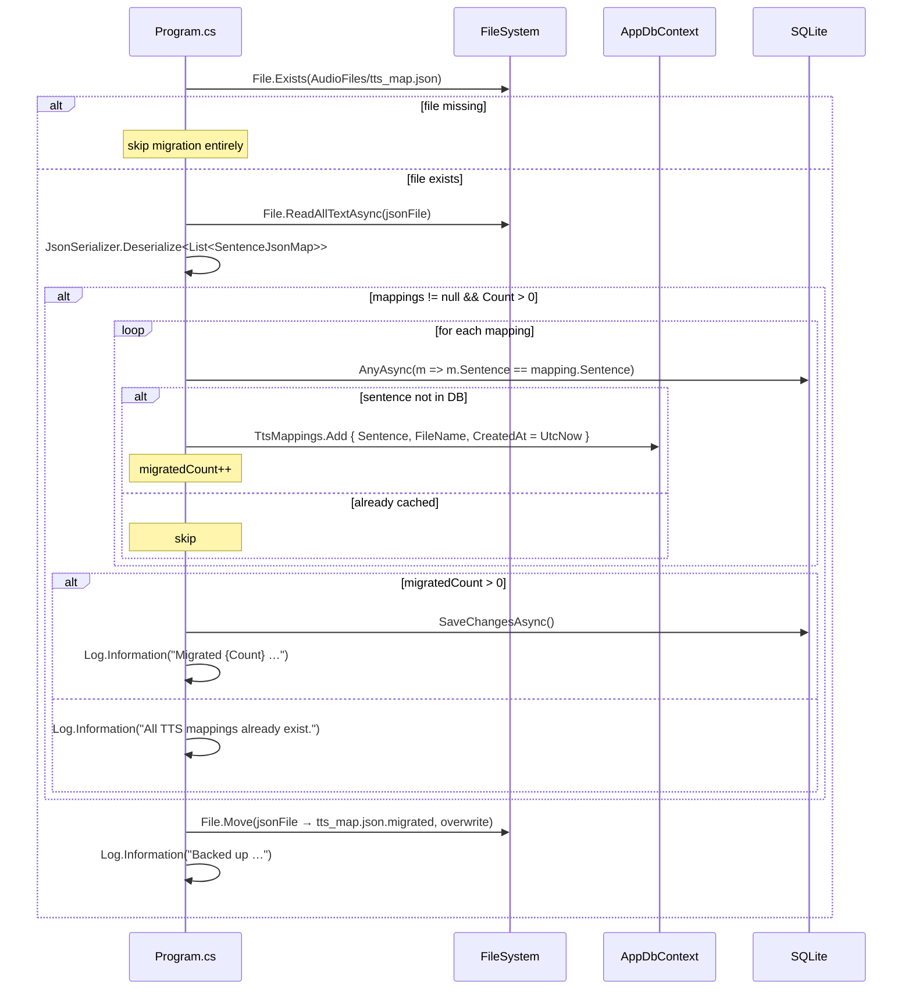

# Data Seeder

This document describes the **data seeder** for the **aclearningutil** project — the startup logic that creates the SQLite database, seeds the system-owned content categories, performs a one-time TTS cache migration, and synchronizes learning content items from on-disk JSON index files.

All seeding runs inline in [`src/aclearningutil/Program.cs`](../src/aclearningutil/Program.cs), inside a single DI scope, immediately after the host is built and before the request pipeline starts. The schema and `HasData` seed data are defined in [`src/aclearningutil/Data/AppDbContext.cs`](../src/aclearningutil/Data/AppDbContext.cs). The full database schema is documented separately in [`docs/design-database.md`](design-database.md).

## Overview

The seeder executes four phases, in order, every time the application starts:

| Phase | What it does | Idempotent? | Source of truth |
|---|---|---|---|
| 0. **Create database** | `EnsureCreated()` builds the schema and applies the EF Core `HasData` seed | Yes (no-op if DB exists) | `AppDbContext.OnModelCreating` |
| 1. **Seed categories** | Inserts the 5 active content categories if missing | Yes (`AnyAsync` + catch `SqliteException`) | Hardcoded array in `Program.cs` |
| 2. **Migrate TTS cache** | One-time import of `AudioFiles/tts_map.json` into `TtsMappings` | Yes (file renamed on success) | `AudioFiles/tts_map.json` |
| 3. **Sync content** | Reconciles `LearningContents` with 5 JSON index files under `Storage/` | Yes (add new, update changed, never delete) | `Storage/<subfolder>/<index>.json` |

**Design goals**

- **Safe to run on every start.** Every phase checks for existing rows before writing; re-running only adds what is missing.
- **Concurrent-start tolerant.** Two instances starting at once will not corrupt each other — unique constraints and caught `SqliteException`s act as a fallback for the `AnyAsync` race.
- **Non-destructive.** Content items that disappear from the JSON index are *never* deleted from the database, because `UserLearningHistories` and `UserLearningRatings` reference them via foreign keys (`OnDelete: Restrict`). They are only logged as orphans.
- **Ensure the database schema is up to date.** `EnsureCreated()` creates the full schema from the EF Core model, so a fresh database always matches the current model. (On an already-existing database the call is a no-op; schema evolution there requires EF Core migrations — see [`docs/design-database.md`](design-database.md) § Modifying the Schema.)

### Overall startup sequence



---

## Phase 0 — Create database (`EnsureCreated`)

```csharp
db.Database.EnsureCreated();
```

`EnsureCreated()` creates the SQLite file and all tables from the EF Core model **only if the database does not already exist**. On the same call it applies the `HasData` seed in [`AppDbContext.OnModelCreating`](../src/aclearningutil/Data/AppDbContext.cs), which inserts **all six** categories:

| Id | NameChinese | NameEnglish | Seeded by |
|---|---|---|---|
| 1 | 词汇 | Vocabulary | `HasData` |
| 2 | 句子 | Sentences | `HasData` |
| 3 | 听力 | Listening | `HasData` |
| 4 | 中文 | Chinese | `HasData` |
| 5 | 公式 | Formula | `HasData` **only** |
| 6 | 知识库 | Knowledge Bank | `HasData` |

> **Note — two discrepancies between `HasData` and the Phase 1 loop:**
> 1. **Category 5 (Formula)** is seeded by `HasData` but is **not** in the Phase 1 runtime array. If a database was created by an older build (before `HasData` included Formula) or if row 5 was manually deleted, the Phase 1 loop will *not* restore it. Only a fresh `EnsureCreated` produces row 5.
> 2. **Category 2 NameEnglish** is `"Sentences"` (plural) in `HasData` but `"Sentence"` (singular) in the Phase 1 array. On a fresh DB the `HasData` value (`"Sentences"`) wins because Phase 1 finds the row already exists and skips it.
>
> These are intentional-looking quirks of the current code; both values are documented here so the behavior is predictable.

Because `EnsureCreated` is a no-op on an existing database, **it does not apply schema changes** to a database that already exists. For schema evolution, use EF Core migrations instead (see [`docs/design-database.md`](design-database.md) § Modifying the Schema).

---

## Phase 1 — Seed content categories

Immediately after `EnsureCreated`, `Program.cs` ensures five active categories exist via an explicit, idempotent loop. This guards the case where the database already exists (so `HasData` did not run) but a category row is missing.



The five categories inserted by this loop:

| Id | NameChinese | NameEnglish |
|---|---|---|
| 1 | 词汇 | Vocabulary |
| 2 | 句子 | Sentence |
| 3 | 听力 | Listening |
| 4 | 中文 | Chinese |
| 6 | 知识库 | Knowledge Bank |

**Concurrency handling.** The `AnyAsync` check and the `SaveChangesAsync` are not atomic across instances. If two instances start simultaneously and both observe "not exists" for the same `Id`, one insert succeeds and the other throws a `SqliteException` (primary-key violation). The `catch (SqliteException)` block calls `db.ChangeTracker.Clear()` to discard the conflicting tracked entity and continues — the category is already present, so the outcome is correct. This is the comment's "INSERT OR IGNORE semantics".

---

## Phase 2 — Migrate TTS cache from `tts_map.json`

This is a **one-time** migration path that imports a legacy JSON cache of sentence→audio-file mappings into the `TtsMappings` table. It is triggered by the presence of `AudioFiles/tts_map.json` and marks completion by renaming the file so it is not re-imported.



**Source model** — [`SentenceJsonMap`](../src/aclearningutil/Models/SentenceJsonMap.cs):

| Property | Type | Maps to |
|---|---|---|
| `Sentence` | string | `TtsMappings.Sentence` (UNIQUE-indexed) |
| `FileName` | string | `TtsMappings.FileName` |

**Deduplication.** `TtsMappings.Sentence` carries a UNIQUE index (see [`AppDbContext`](../src/aclearningutil/Data/AppDbContext.cs)). The `AnyAsync` pre-check avoids duplicates in the common case; the unique index is the hard guarantee. `CreatedAt` is set explicitly to `DateTime.UtcNow` (overriding the column's `datetime('now')` default) so imported rows carry the migration timestamp.

**Completion marker.** Regardless of whether any rows were migrated, the file is renamed to `tts_map.json.migrated` (overwriting any previous backup). On the next start the source file no longer exists, so the phase is skipped. If the migration throws, the `catch (Exception)` logs a warning and the file is *not* renamed — so the next start will retry.

---

## Phase 3 — Sync `LearningContents` from JSON index files

This is the most substantial phase. It reconciles the `LearningContents` table with five JSON index files on disk, one per content category. The work is done by a single local function, `SyncLearningContentsFromJsonAsync`, invoked five times with different parameters.

### The five sync calls

| # | Subfolder | Index file | CategoryId | Category |
|---|---|---|---|---|
| 1 | `learnenglish` | `words.json` | 1 | Vocabulary |
| 2 | `learnenglish` | `sentences.json` | 2 | Sentences |
| 3 | `knowledge-exercises` | `data.json` | 6 | Knowledge Bank |
| 4 | `learnchinese` | `data.json` | 4 | Chinese |
| 5 | `englishlistening` | `data.json` | 3 | Listening |

> **Note:** Category 5 (Formula) has no sync call — it has no on-disk content yet (see [`docs/design-database.md`](design-database.md)).

### JSON index file format

Each index file is a JSON array of objects. The seeder is tolerant of two name keys:

```json
[
  { "name": "CET 4", "file": "cet4.json" },
  { "book": "Listen To This: I", "file": "ltt1.json" }
]
```

| Key | Required | Purpose |
|---|---|---|
| `file` | yes | Filename within the subfolder; used to build `FileUrl`. Entries missing this (or non-string) are skipped with a warning. |
| `name` | one of `name`/`book` | Standard content name. Written to both `NameChinese` and `NameEnglish`. |
| `book` | (alternative to `name`) | Legacy key used by `englishlistening`. Used only when `name` is absent. |

If neither `name` nor `book` is present (or empty), the entry is skipped with a warning.

### `FileUrl` patterns and legacy migration

The seeder writes `FileUrl` in the **primary** form `storage/{subFolder}/{file}`. To recognize rows written by older builds, it also matches two legacy forms when looking for an existing record:

| Pattern | Role |
|---|---|
| `storage/{subFolder}/{file}` | **Primary** — always used for new inserts and as the migration target. |
| `data/{subFolder}/{file}` | Legacy form #1 — recognized for matching; migrated to primary if found. |
| `{subFolder}/{file}` | Legacy form #2 — recognized for matching; migrated to primary if found. |

### Sync sequence (per index file)

```mermaid
sequenceDiagram
    participant App as SyncLearningContentsFromJsonAsync
    participant FS as FileSystem
    participant DB as AppDbContext
    participant SQLite as SQLite

    App->>FS: File.Exists(Storage/{sub}/{index}.json)
    alt missing
        App->>App: LogWarning("Index file not found …"); return
    end
    App->>FS: File.ReadAllTextAsync
    App->>App: Deserialize JsonElement[] (case-insensitive)
    alt null or empty
        App->>App: LogWarning("No entries …"); return
    end

    Note over App: Build jsonFileUrls set — 3 URL patterns per entry
    App->>SQLite: existingMatches = LearningContents<br/>Where(CategoryId == id && FileUrl in jsonFileUrls)

    loop for each JSON entry
        App->>App: name = entry["name"] ?? entry["book"]; file = entry["file"]
        alt name or file missing/empty
            App->>App: LogWarning; continue
        end
        App->>App: existing = existingMatches.FirstOrDefault(match by 3 URL patterns)
        alt existing found
            App->>App: if FileUrl != primary → migrate to storage/{sub}/{file}
            App->>App: if NameChinese/NameEnglish changed → update + UpdatedAt = UtcNow
        else not found
            App->>DB: LearningContents.Add(new { CategoryId, name, name, primaryFileUrl, UtcNow, UtcNow })
            Note over App: addCount++
        end
    end

    alt addCount > 0
        App->>SQLite: SaveChangesAsync()
        App->>App: LogInformation("Added {Count} …")
    end

    Note over App: Orphan detection
    App->>App: orphaned = existingMatches where FileUrl NOT in jsonFileUrls
    alt orphaned.Count > 0
        App->>App: LogWarning("Found {Count} in DB but not in JSON — NOT deleted")
    end
```

### What gets written

For a JSON entry with no matching DB row, a new `LearningContent` is inserted:

| Column | Value |
|---|---|
| `CategoryId` | the call's `categoryId` |
| `NameChinese` | `name` |
| `NameEnglish` | `name` (same value) |
| `FileUrl` | `storage/{subFolder}/{file}` |
| `CreatedAt` | `DateTime.UtcNow` |
| `UpdatedAt` | `DateTime.UtcNow` |

For an entry that matches an existing row (by any of the three URL patterns), the seeder **patches in place**:
- If `FileUrl` is a legacy form, it is rewritten to the primary `storage/...` form.
- If `NameChinese` or `NameEnglish` differ from `name`, both are updated and `UpdatedAt` is bumped to `DateTime.UtcNow`.

### Orphan handling (non-destructive)

After processing all JSON entries, the seeder computes the set of pre-loaded `existingMatches` whose `FileUrl` is **not** in `jsonFileUrls` — i.e. rows that exist in the database for this category but have no corresponding entry in the JSON index. These are **logged as warnings only**:

```
Found {Count} content items for category {CategoryId} in DB but not in {JsonFileName}: {Titles}.
These are NOT deleted to protect user learning histories and ratings. Remove them manually if needed.
```

This protects referential integrity: `UserLearningHistories.ContentId` and `UserLearningRatings.ContentId` both reference `LearningContents(Id)` with `OnDelete: Restrict`. Deleting a content item that a user has history or ratings for would either fail or orphan user data. Manual removal is left to the operator.

> **Behavior caveat — pure updates are not always persisted.** `SaveChangesAsync()` is called **only when `addCount > 0`**. If a sync pass produces *only* in-place updates (a URL migration or a name change) and **no** new inserts, those tracked changes are not saved to the database on that pass. In practice this is rarely visible, because a pass that touches existing rows usually also adds new ones; but a JSON index that only renames titles (and adds nothing new) will not have its title changes persisted until at least one new item is added in a later pass. New inserts are always persisted.

### Per-entry error isolation

Each entry is processed inside its own `try/catch`. A malformed entry (missing/invalid `file`, JSON type mismatch, etc.) logs a warning and the loop continues with the next entry — one bad entry does not abort the sync for the whole file.

---

## Idempotency & safety summary

| Property | How it is guaranteed |
|---|---|
| **Re-runnable on every start** | Phase 1 `AnyAsync` check; Phase 2 file rename; Phase 3 add-only-with-match-check. |
| **No duplicate categories** | `AnyAsync` pre-check + PK violation caught as `SqliteException` + `ChangeTracker.Clear()`. |
| **No duplicate TTS mappings** | `AnyAsync` pre-check + UNIQUE index on `TtsMappings.Sentence`. |
| **No duplicate content items** | Pre-loaded `existingMatches` matched by `CategoryId` + three `FileUrl` patterns. |
| **No data loss on content removal** | Orphans are logged, never deleted (protects user history/rating FKs). |
| **Concurrent-start safe** | Caught `SqliteException` in Phase 1; per-entry `try/catch` in Phase 3; UNIQUE/PK constraints as last line of defense. |
| **One-time TTS migration** | `tts_map.json` renamed to `tts_map.json.migrated` on success; retried on failure. |

## When the seeder runs

The entire seeding block runs **synchronously before `app.Run()`**, inside a single `using` scope that disposes the `AppDbContext`. This means:

- The server does **not** begin accepting requests until seeding completes.
- If a JSON index file is large, the `ReadAllTextAsync` + deserialize + per-entry matching happens on the startup path — first-request latency is unaffected, but process start is.
- Failures in Phase 1 (other than the expected `SqliteException`) and Phase 3 (outside per-entry `try/catch`, e.g. `ReadAllTextAsync` IO errors) will propagate and prevent the application from starting. Phase 2 failures are swallowed with a warning and do not block startup.

## Inspecting seeded data

```bash
sqlite3 src/aclearningutil/aclearningutil.db
> SELECT * FROM LearningContentCategories;
> SELECT Id, CategoryId, NameEnglish, FileUrl FROM LearningContents ORDER BY CategoryId;
> SELECT COUNT(*) FROM TtsMappings;
> -- Confirm the TTS migration file was renamed:
> ls src/aclearningutil/AudioFiles/tts_map.json.migrated
```

## Related documents

- [`docs/design-database.md`](design-database.md) — full database schema, constraints, and the `HasData` seed definition.
- [`docs/design-controllers.md`](design-controllers.md) — the API controllers that read and write the seeded tables at runtime.
